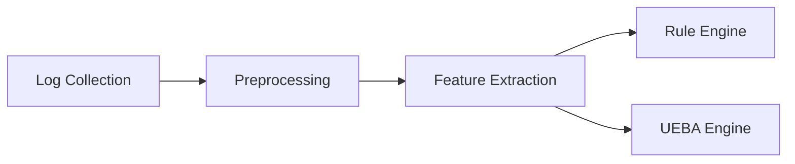

# Statistical-UEBA

This is an experiment derived from the following Thesis question: To what extent does a statistical UEBA-based detection model outperform rule-based detection systems in reducing false positives and improving detection accuracy on the CERT Insider Threat Dataset? 

## Project Description 
The study adopts a comparative evaluation of two different detection mechanisms: a Rule-Based Detection Engine and a Statistical User and Entity Behavior Analytics (UEBA) Model.The proposed framework processes enterprise log data, extracts behavioral features, construct user behavioral baseline, and detects anomalies through statistical analysis and rule correlation.  

### Research Design

## Dataset Description
The CERT Insider Threat Dataset simulates activity of 1,000 employees over 18 months inside an enterprise environment. It is widely used in anomaly detection papers. This study utilizes version 4.2 and extract 8 month period to maintain computational efficiency.

## Evaluation Metrics 
Top-K evaluation metrics are used since the two detection engines produce different output.The metrics is very valuable in SOC environments and when the aim is to improve efficiency and lower operational cost. 
